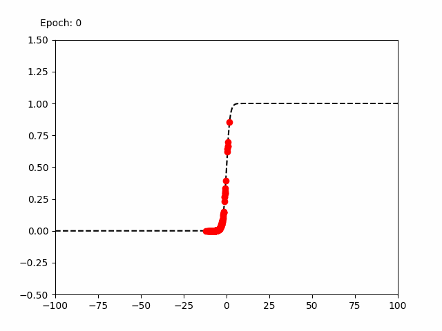
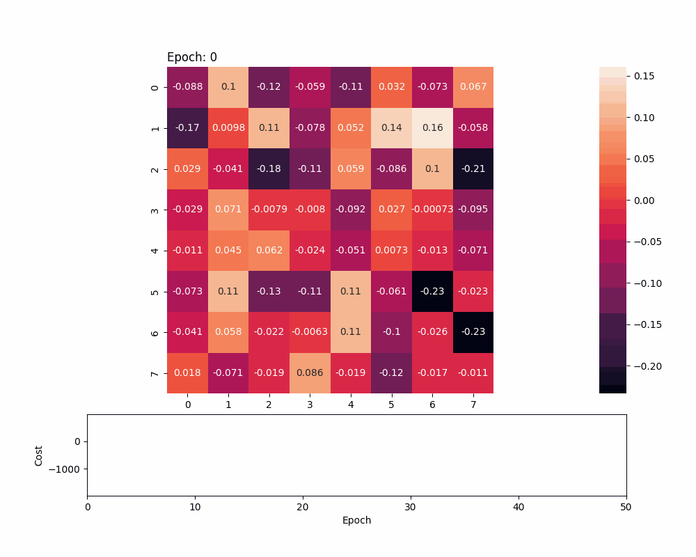

### Presentation of the project

In this project, I first explain the **theory** behind the **logistic regression** model, and then I develop a **class** that implements it. 
Finally, I used the **digits dataset** from sklearn.datasets (I actually kept the digits 0 and 1 to match the scope of my model) to **test and evaluate** the logistic regression class, and provide two **visualizations**: one showing the cost function over epochs, and another illustrating the updates of the weights.
Those two visualizations can be found below.

It's interesting to note that the highest value form a zero after the model has been trained.

## Logistic function
 \
We can see our probabilities $p(x) = \frac{\exp( x^T  \beta)}{1 + \exp( x^T  \beta)}$ getting updated at each epoch in function of our product $x^T \beta$.

## Parameter Updates and Cost Function Visualization
 \
We can see our $\beta$ and our cost function (here our log-likelihood) getting updated over the epochs.

